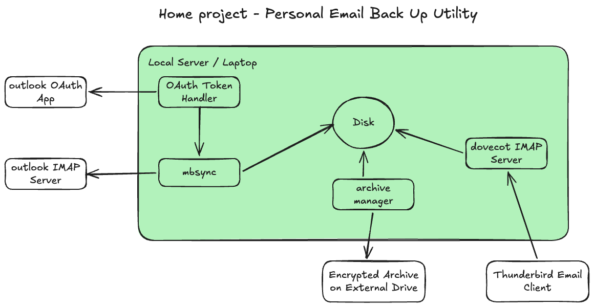

# Project 01 - Email Back Up

## Overview

Building a local service to back up personal emails with potentially thousands of email files.

**Motivations**

- reduce dependency on email service providers
- reduce historic email data exposure in case of unauthorised access (archived and backed up emails can be deleted from the provider's server)

**Topics**

`IMAP`, `OAuth2`, `SASL XOAUTH2`, `Microsoft Entra ID`

## Technical Notes

### Background Reading

- [Microsoft - Authenticate an IMAP, POP or SMTP connection using OAuth](https://learn.microsoft.com/en-us/exchange/client-developer/legacy-protocols/how-to-authenticate-an-imap-pop-smtp-application-by-using-oauth)
- [Gmail - OAuth 2.0 Mechanism (xoauth2-protocol)](https://developers.google.com/workspace/gmail/imap/xoauth2-protocol)
- [arch linux - isync](https://wiki.archlinux.org/title/Isync)
- [RFC 9051 - Internet Message Access Protocol (IMAP)](https://datatracker.ietf.org/doc/html/rfc9051)
- [RFC 4422 - Simple Authentication and Security Layer (SASL)](https://datatracker.ietf.org/doc/html/rfc4422)
- [Dovecot Community Edition](https://doc.dovecot.org/)

### Security Topics

- **OAuth 2.0**
- **IMAP**
- **xoauth2**

### PoC

- https://github.com/vk3akr/util-email-backup
- https://github.com/vk3akr/util-outlook-oauth
